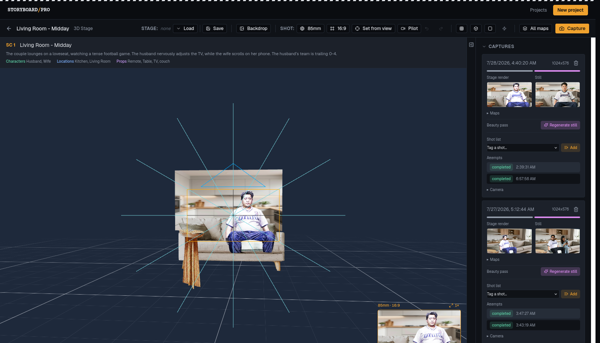
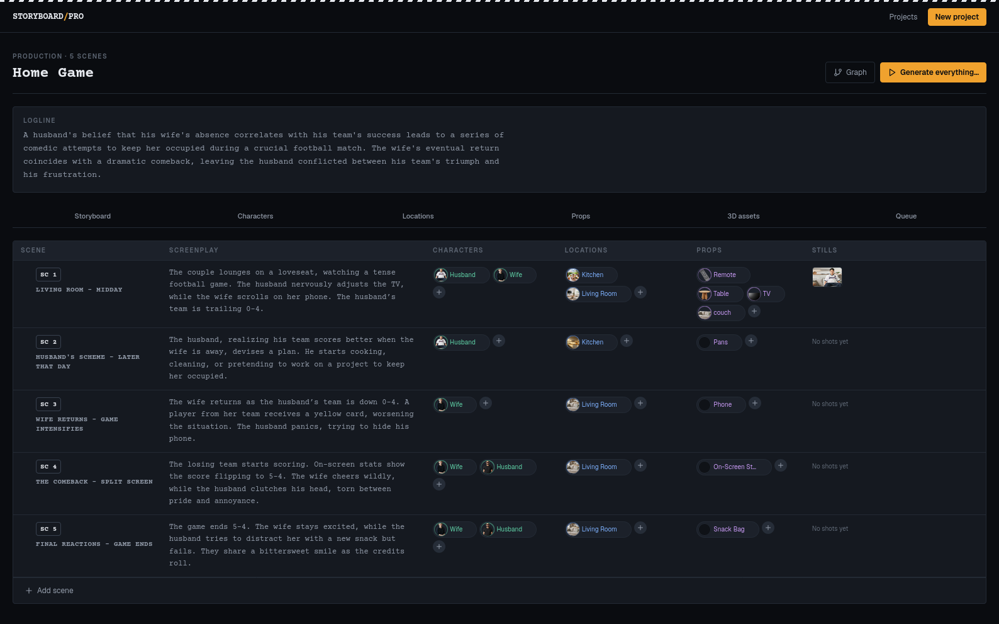
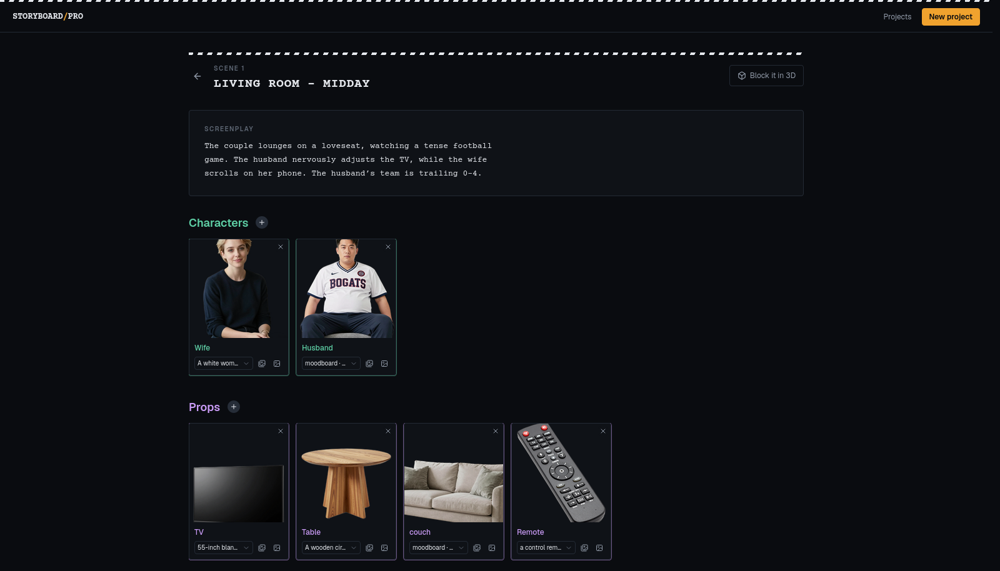
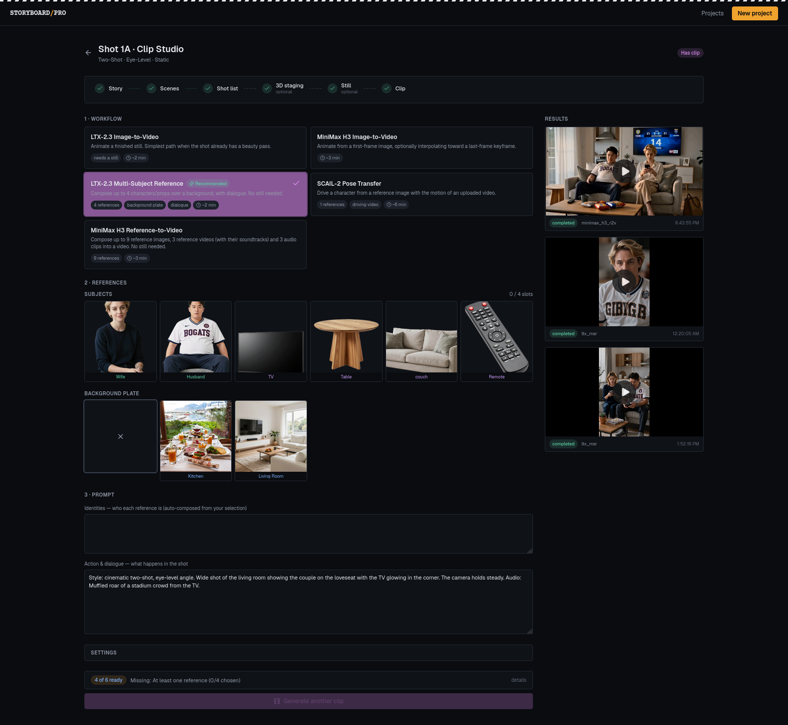
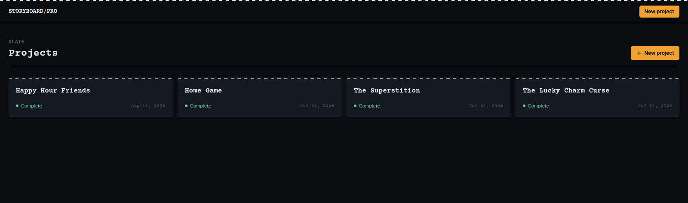
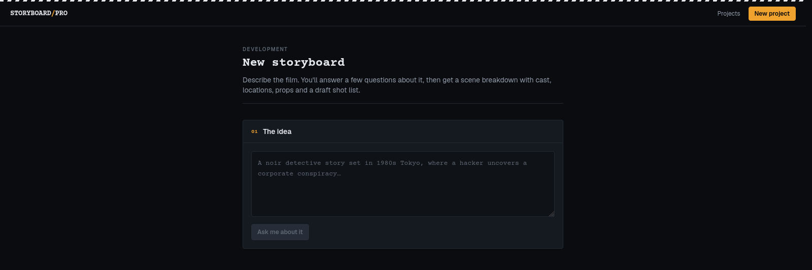

<p align="center">
  <h1 align="center">Storyboard Pro</h1>
  <p align="center"><strong>From a one-line idea to a fully realized storyboard</strong></p>
  <p align="center">AI-assisted storyboard &amp; creative-media studio — script breakdown, image, video, and 3D generation in one self-hosted pipeline</p>
</p>

<p align="center">
  <a href="#-research-use-only"></a>
  <a href="#"></a>
  <a href="#"></a>
  <a href="#"></a>
  <a href="#"></a>
  <a href="#"></a>
  <a href="#"></a>
  <a href="#"></a>
</p>

<p align="center">
  
</p>

<p align="center">
  <a href="#-features">Features</a> •
  <a href="#%EF%B8%8F-tech-stack">Tech Stack</a> •
  <a href="#-screens">Screens</a> •
  <a href="#-getting-started">Getting Started</a> •
  <a href="#-architecture">Architecture</a> •
  <a href="#-project-structure">Structure</a> •
  <a href="#-research-use-only">Research Use Only</a>
</p>

---

## ✨ Features

- **🧠 LLM Story Breakdown** — Type a project idea and a local LLM expands it into structured scenes, characters, locations, and props
- **🎭 Prompt &amp; Style Profiles** — Each entity gets a generated, human-editable `prompt_profile`; projects get a `style_profile`, so appearance and look stay consistent across every shot
- **🖼️ Multi-Model Image Generation** — 12+ ComfyUI workflows (Z-Image Turbo, Flux-2 Klein edit, Krea2, plate/outpaint/angle passes) without touching Python per model
- **🎬 Clip Studio** — Image-to-video, reference-to-video, and SCAIL-2 pose-transfer animation with a driving-video library
- **🧊 3D Staging** — Turn a single image into a Gaussian splat or a textured mesh (TripoSG / Trellis2), with mesh optimization and background removal side-cars
- **⚙️ Server-Side Job Worker** — A background async worker claims queued jobs, submits them to ComfyUI, polls to a terminal state, retries with backoff, and reaps orphans — generation advances with no browser in the loop
- **📦 Batch Automation** — Queue a whole scene or shot list as one batch, then cancel, retry-failed, inspect artifacts, and commit the results
- **🔗 Polymorphic References** — Attach any generated asset to any entity (scene / character / location / prop) via one flexible model
- **🔒 Proxied Media** — All output is served through the API, never exposed directly from the GPU engine
- **🔁 Swap Models via JSON** — Each workflow ships as a graph + `*.map.json` node map; add a model with two files, not code
- **🌙 Modern Dark UI** — Built with React, Vite, and Tailwind v4

---

## 🛠️ Tech Stack

| Technology | Purpose |
|---|---|
| [FastAPI](https://fastapi.tiangolo.com/) | Async Python API and orchestration layer |
| [SQLAlchemy (async)](https://docs.sqlalchemy.org/) | ORM over PostgreSQL with Alembic migrations |
| [PostgreSQL](https://www.postgresql.org/) | Persistent storage for projects, assets, jobs, and batches |
| [ComfyUI](https://github.com/comfyanonymous/ComfyUI) | Headless GPU engine for image / video / 3D generation |
| [llama.cpp](https://github.com/ggml-org/llama.cpp) | Self-hosted, OpenAI-compatible LLM server (Qwen3-14B GGUF) for story breakdown |
| [React + Vite](https://vitejs.dev/) | Frontend SPA |
| [Tailwind CSS v4](https://tailwindcss.com/) | Styling and design system |
| [Docker + K3s](https://k3s.io/) | Containerized deploy on a home Kubernetes cluster |

The LLM layer talks plain OpenAI-compatible HTTP, so `OPENAI_BASE_URL` can point at the
bundled `llama` container or at any hosted provider (OpenRouter, etc.) instead.

---

## 📱 Screens

### Storyboard

Every scene the LLM broke out of the idea, with its cast, locations, props and stills —
plus tabs for characters, locations, props, 3D assets and the generation queue.



### Scene detail

One scene up close: screenplay, the entities attached to it, their reference images, and
the master shot list underneath.



### Block it in 3D — Scene Stage

Block the scene in 3D: place characters and props on the stage, frame the shot with a real
camera (lens, aspect, pilot mode), and capture depth / edge / normal / segmentation maps
that drive the still generation. Captures and their attempts live in the right rail.


### Clip Studio

Pick a video workflow, choose the subject and background-plate references, compose the
prompt, and queue the clip. Finished clips stack up in the results rail.



### Projects &amp; New project

<p>
  
  
</p>

> A **Graph** view (entity relationships) also ships, but its node layout is unfinished, so
> it is left out of the tour above.

---

## 🚀 Getting Started

> Reminder: this stack is for local research use. Run it on a machine you control, on a
> trusted network — it ships with no auth and default credentials.

### Prerequisites

- Docker + Docker Compose, with the NVIDIA container runtime
- **Two NVIDIA GPUs by default** — ComfyUI is pinned to device 1, llama.cpp to device 0, so image/video work never contends with the language model. Single-GPU users: edit the `device_ids` in `docker-compose.yml`.
- A GGUF model file under `./models/` (the default config expects `Qwen3-14B-Q4_K_M.gguf`)
- `/opt/ComfyUI/input` and `/opt/ComfyUI/output` on the host — bind-mounted so ComfyUI and the API share uploads and results off disk
- For running the backend natively instead: Python ≥ 3.11 and Node.js ≥ 18

### Setup

```bash
git clone https://github.com/AnthomasGit/FastAPI_Portfolio.git
cd FastAPI_Portfolio
cp .env.example .env
```

Fill in `.env`:

| Variable | Meaning |
|---|---|
| `OPENAI_BASE_URL` | LLM endpoint — `http://llama:8080/v1` for the bundled server |
| `OPENAI_API_KEY` | Any non-empty string for llama.cpp; a real key for a hosted provider |
| `LLM_MODEL` | Model alias, must match the `--alias` llama.cpp is started with |
| `LLAMA_GGUF` | GGUF filename inside `./models/` |
| `LLAMA_CTX` / `LLAMA_NGL` / `LLAMA_EXTRA_ARGS` | Context size, GPU layers, extra llama.cpp flags |
| `DATABASE_URL` | Async Postgres URL |
| `COMFY_API_URL` | ComfyUI endpoint (`http://comfyui:8188` in Compose) |

Optional worker/tuning knobs: `WORKER_ENABLED`, `MAX_INFLIGHT`, `WORKER_TICK_INTERVAL`,
`JOB_POLL_INTERVAL`, `JOB_POLL_TIMEOUT`, `JOB_RETRY_BACKOFF_BASE`, `VIDEO_TIMEOUT_MINUTES`,
`BATCH_DISK_MARGIN`.

Then bring the stack up:

```bash
docker compose up
```

Compose runs `alembic upgrade head` as a one-shot `migrate` service and waits for the
llama server's health check before the API starts, so the first request never lands on a
model that is still loading. First boot is slow: ComfyUI installs its custom nodes at
start-up and the GGUF has to be read into VRAM.

The API serves on `:8000` (docs at `/docs`) and the Vite dev server on `:5173`.

### Testing

Backend tests run against in-memory SQLite with mocked GPU calls — no Postgres and no live ComfyUI required:

```bash
cd backend && pytest
```

---

## 🏗️ Architecture

| Layer | Tech | Port | GPU |
|---|---|---|---|
| Frontend | React + Vite + Tailwind v4 | 5173 (dev) / 80 (prod) | — |
| API | FastAPI (async Python) + background job worker | 8000 | — |
| Engine | ComfyUI (headless) | 8188 | device 1 |
| LLM | llama.cpp server (OpenAI-compatible) | 8080 | device 0 |
| Database | PostgreSQL 15 (async SQLAlchemy) | 5432 | — |
| Side-cars | Mesh optimizer · background remover | 8300 / 8400 | — |
| Deploy | Docker Compose · K3s · Cloudflare Tunnel (public demo: coming soon) | — | — |

**Key engineering decisions**

- **Async everywhere** — FastAPI + async SQLAlchemy + `httpx` keep long-running generation jobs from blocking the API
- **Jobs live in the database** — a single worker loop claims `JobRecord` rows, so progress survives a page reload and orphaned `running` jobs are reaped on restart
- **Data-driven workflows** — a `*.map.json` node map indirects prompt/seed/image injection, so ComfyUI graphs swap without code changes
- **Polymorphic references** — one `Reference` model attaches assets to any entity type via a type-tagged relationship
- **Profiles over prose** — generated prompt/style profiles are stored, editable, and reused, which is what keeps a character looking like the same character across shots
- **GPU-friendly serving** — a shared input volume lets ComfyUI read uploads off disk; output is proxied through FastAPI

> **The frontend never talks to ComfyUI directly** — all generation and media access is mediated by the API.

---

## 📁 Project Structure

```
FastAPI_Portfolio/
├── backend/                # FastAPI application
│   ├── routers/            # API routes (projects, scenes, shots, generate, video, staging, batches, profiles, ...)
│   ├── services/           # Orchestration: job worker/handlers, batch, profile, workflow registry, ComfyUI client
│   ├── workflows/          # ComfyUI graphs + *.map.json node maps
│   ├── database.py         # Async engine, ORM models, association tables (single source of truth)
│   └── tests/              # pytest-asyncio suite (SQLite + mocked GPU)
├── portfolio-ui/           # React + Vite frontend
│   └── src/
│       ├── routes/         # Projects, NewProject, Storyboard, SceneDetail, SceneStage, ClipStudio, Graph
│       ├── components/     # clip / project / scene / stage3d / storyboard / ui
│       └── lib/api.js      # Flat client wrapping every backend endpoint
├── comfyui/                # ComfyUI image build + boot scripts + extra workflows
├── optimizer/ · bg_remover/  # Mesh optimization and background-removal side-cars
├── models/                 # GGUF language models (gitignored)
├── docs/                   # Workflow authoring, batching &amp; automation notes, screenshots
├── docker-compose.yml
└── portfolio.yaml          # K3s deployment manifest
```

---

## 🤝 Contributing

This is a personal research repository rather than a maintained open-source project, so
there is no roadmap and no guarantee that pull requests get reviewed. Issues and forks are
welcome all the same — if something here is useful to your own research, take it and run.

---

## 🔬 Research Use Only

> **This project is a personal research and portfolio experiment. It is provided for
> research, learning, and demonstration purposes only — it is not a product, and it is
> not intended or supported for production or commercial use.**

Specifically:

- **No warranty, no support, no stability guarantees.** Schemas, APIs, and workflow graphs change without notice or migration path.
- **No authentication or authorization.** Every endpoint is open; the stack is meant to run on a trusted local network, never exposed to the public internet as-is.
- **Generated output is experimental.** Images, video, and 3D assets produced here are research artifacts. Do not publish or commercialize them without checking the licence of every model and checkpoint you loaded into ComfyUI — model weights carry their own terms, and this repository grants you nothing with respect to them.
- **Third-party terms apply.** ComfyUI, the custom nodes, the GGUF language model, and any hosted LLM endpoint you point it at are each governed by their own licences and acceptable-use policies. Complying with them is your responsibility.
- **Respect other people's likeness and copyright.** The reference-image, pose-transfer, and character-consistency features make it easy to reproduce a real person or a copyrighted character. Only use material you have the right to use.

---

## 📄 License

**No open-source licence is granted.** The code is published for reading, research, and
portfolio review only; all rights are reserved by the author, Anthomas Longobardi. If you
want to reuse any of it, open an issue and ask.

Models, checkpoints, custom nodes, and any external LLM endpoint used with this project
are covered by their own licences — see [Research Use Only](#-research-use-only).

---

<p align="center">
  Built by <strong>Anthomas Longobardi</strong> — <a href="https://github.com/AnthomasGit">@AnthomasGit</a>
  <br />
  <em>A research playground for generative-media pipelines.</em>
</p>
